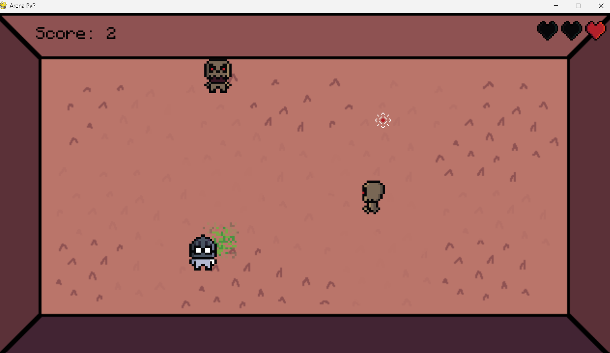

# Arena PvP

A top-down arena shooter built with Python and [pygame](https://www.pygame.org/). Survive waves of enemies that chase you around the arena, shoot them down, and try to get your name at the top of the local leaderboard.

   

## Features

- Top-down movement and mouse-aimed shooting
- Enemies spawn continuously and chase the player
- Three lives, shown as hearts in the top-right corner
- Screen shake and particle effects when enemies are destroyed
- Name entry at startup, so scores are saved under your name
- Local leaderboard stored in a SQLite database (top 10 scores)
- Pause menu and game over screen with quick restart

## Requirements

- Python 3.8 or newer
- pygame

## Installation and running
```bash
git clone https://github.com/blejzerrr/2D-Arena-PvP-game.git
cd 2D-Arena-PvP-game
pip install pygame
python main.py
```

## Controls

| Input | Action |
| --- | --- |
| `W` `A` `S` `D` | Move |
| Mouse | Aim |
| Left click | Shoot |
| `Esc` or `P` | Pause / resume |

**Menus**

| Input | Action |
| --- | --- |
| `Enter` or `Space` | Start game (main menu) |
| `L` | Open leaderboard (main menu) |
| `Esc` or `Backspace` | Back (leaderboard) |
| `R` | Restart (game over screen) |
| `M` | Main menu (game over screen) |

## How to play

Enemies spawn around the arena and head straight for you. Each enemy takes three hits to destroy, and each one you destroy scores a point. If an enemy touches you, you lose a heart. Lose all three and the game is over, and your score is saved to the leaderboard.

## High scores

Scores are saved locally in a `highscores.db` file, which is created automatically the first time you run the game. Nothing is sent online, and each player on each machine has their own leaderboard. To reset your scores, delete `highscores.db`.

## Sound

Most sound effects and the menu music are not included in this repo, so the
   game runs mostly silent. To add your own, place `huah.mp3` (enemy death),
   `eek.mp3` (player hit), `death.mp3` (dying sound) and `lobby.mp3` (lobby music)
   in `assets/sounds/`.

## Project structure

```
├── main.py              # Entry point
├── assets/              # Images, font and sounds
├── entities/            # Player, enemies, projectiles and base game object
└── game/
    ├── game.py          # Main game loop
    ├── audio.py         # Sound loader that tolerates missing files
    ├── highscores.py    # SQLite high score storage
    ├── state_manager.py # Base class for game states
    └── states/          # Menu, name entry, pause and leaderboard screens
```

## Credits

The images, font and gun sound are from Danial's pygame tutorial, used under the MIT License.
See [CREDITS.md](CREDITS.md) for details and the full licence.

Danial has a full YouTube playlist on building the game step by step. The tutorial was not followed as a development guide; I used the provided assets and developed the game's code independently. All the code is my own, and some features, like the high score database, aren't in his tutorial and
were implemented by me.
